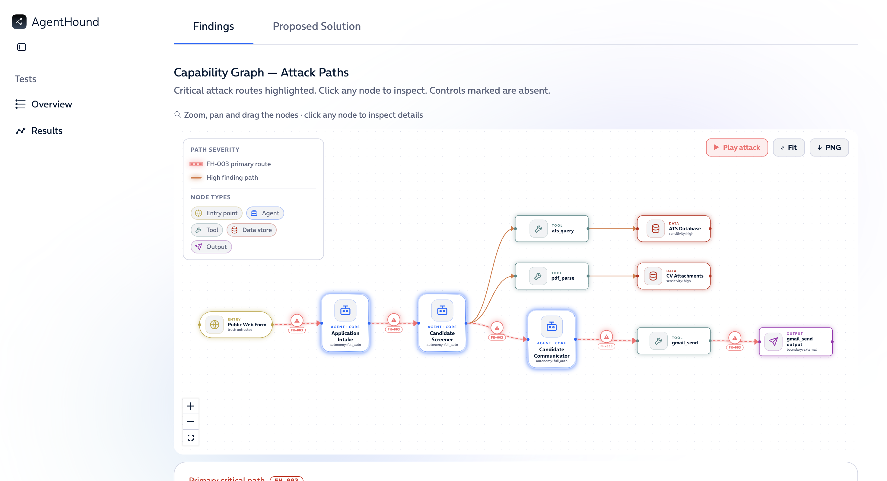

# AgentHound

AgentHound analyzes multi-agent architecture definitions (CrewAI, Dify, LangGraph, generic YAML) for capability paths that lead to risk, following a BloodHound-style model: typed capability edges between nodes, risk evaluated on the combination of capabilities, node properties, and missing controls.



"Generic YAML" is not a third-party framework but AgentHound's own explicit `nodes`/`edges` format: a thin authoring layer over the internal model that the framework adapters also target, and the most expressive of the four (it can describe full capability paths the tree-shaped adapter outputs cannot). It is auto-detected from top-level `nodes` and `edges`.

## Repository layout

- [`Backend/`](Backend/) — FastAPI backend service (Pydantic v2 + NetworkX). See [`Backend/app/docs/README.md`](Backend/app/docs/README.md) for backend-only details.
- [`Frontend/`](Frontend/) — Next.js + Mistica web app. The threat-model wizard uploads an architecture YAML, calls the backend, and renders the capability graph, findings, and risk metrics. See [`Frontend/README.md`](Frontend/README.md).
- [`examples/`](examples/) — Engine-verified example architectures (four progressive scenarios as CrewAI, Dify, LangGraph, and generic YAML, plus a risky/safe pair migrated from an earlier proof of concept) with per-scenario notes, usable as a demo set and regression bank. See [`examples/README.md`](examples/README.md).

## Status

The backend is implemented: generic YAML parser, normalized IR, NetworkX graph, the v0.2 rule catalog (35 rules across path, node and edge patterns) with each finding classified as an attack path or a hygiene/compliance signal, numeric scoring, and the read API. Analysis is two-stage: `POST /analyses` parses the YAML into a stored graph, then `POST .../analyze` runs the rule engine (`GET .../graph`, `GET .../findings` read the result).

The **frontend is linked to the backend**: the wizard performs a real analysis end-to-end (upload → parse → review/correct capabilities in the **Inference** step → analyze → rendered results). The Inference step's capability edits feed the analyzed graph, so the findings, scores, and counts follow the user's corrections. **Phase 2 (control recommendation + simulation)** is implemented on both sides — the backend serves `GET .../controls/recommendations` and `POST .../simulate-controls`, and the UI's "Proposed Solution" tab renders the live before/after metrics, remediation timeline, and mitigated graph. **Phase 3** adapters (CrewAI, Dify, LangGraph) are implemented; generic-format YAML is also processed (see [Try it](#try-it)).

## Running locally

The app is two processes: the **backend** API on port `8000` and the **frontend** dev server on port `3000`. Start the backend first, then the frontend. The backend allows any `localhost` origin by default, so no extra configuration is needed for local development.

For local development the recommended backend runtime is a **Python virtual environment** (it pairs naturally with the `pnpm` frontend over `localhost`). A **Docker** image is also provided for a self-contained backend run; see [Backend option B](#backend-option-b-docker).

### Backend (option A: venv — recommended)

Requires Python 3.11+.

```bash
# from Backend/
python -m venv .venv
. .venv/bin/activate            # Linux/macOS
# .venv\Scripts\Activate.ps1    # Windows (PowerShell)
pip install -e ".[dev]"
uvicorn app.main:app --reload
```

The API is now at `http://127.0.0.1:8000` (Swagger UI at `/docs`, health at `/health`).

### Backend (option B: Docker)

```bash
# from Backend/
docker build -t agenthound-backend .
docker run -p 8000:8000 -v "$PWD/data:/data" agenthound-backend
```

### Frontend

Requires Node.js 20+ and [pnpm](https://pnpm.io/) (the repo pins `pnpm@11`).

```bash
# from Frontend/
pnpm install
pnpm dev
```

Open `http://localhost:3000` and go to **New model** to run the wizard.

The frontend targets `http://localhost:8000` by default. To point it at a
different backend, set `NEXT_PUBLIC_AGENTHOUND_API_URL` (e.g. in
`Frontend/.env.local`):

```bash
NEXT_PUBLIC_AGENTHOUND_API_URL=http://localhost:8000
```

### Backend environment variables

| Variable | Default | Purpose |
|----------|---------|---------|
| `AGENTHOUND_CORS_ORIGINS` | any `localhost` origin | Comma-separated exact origins to allow (set for a non-localhost frontend). |
| `AGENTHOUND_DATA_DIR` | `./data` | Where analyses are persisted as JSON. |
| `AGENTHOUND_MAX_UPLOAD_BYTES` | `2097152` (2 MiB) | Maximum accepted upload size. |

## Testing

Backend (pytest):

```bash
# from Backend/ (venv active)
pytest
```

Frontend (type-check, lint, and unit tests):

```bash
# from Frontend/
pnpm test:ts
pnpm lint
pnpm test
```

## Try it

The end-to-end path works today with **generic-format YAML** (top-level `nodes`/`edges`; the backend auto-detects the `generic` framework). A ready fixture ships in the repo:

```bash
# from Backend/ (backend running on :8000)
# 1. Parse the YAML into a stored graph (no rules run yet: findings are 0).
curl -F "file=@tests/fixtures/hiresmart_generic.yaml" http://127.0.0.1:8000/analyses
# -> {"analysis_id": "...", "status": "parsed", "summary": {...}}
# 2. Run the analysis (empty body = analyze the parsed graph as-is; send a
#    {nodes, edges} body to analyze an edited graph). This produces the findings.
curl -X POST http://127.0.0.1:8000/analyses/<analysis_id>/analyze
curl http://127.0.0.1:8000/analyses/<analysis_id>/graph
curl http://127.0.0.1:8000/analyses/<analysis_id>/findings
```

In the UI, upload the same fixture and select the **n8n** framework (which routes to backend auto-detection for this generic-format file). CrewAI, Dify, and LangGraph are supported by the Phase 3 adapters. The CrewAI config step accepts its native two files (`agents.yaml` + `tasks.yaml`); the wizard merges them into the single `agents:`/`tasks:` document the backend ingests.

For the full REST contract, IR schema, and rule/scoring details, see [`Backend/app/docs/`](Backend/app/docs/README.md).

## License

AgentHound is released under the GNU Affero General Public License v3.0 (AGPL-3.0). See [`LICENSE`](LICENSE) for the full text.

**Disclaimer:** AgentHound is provided "as is", without warranty of any kind, and is intended for authorized security assessment and educational use only. You are responsible for ensuring that your use complies with all applicable laws and that you have permission to analyze the systems and configurations you submit. See [`LICENSE`](LICENSE) for the complete warranty disclaimer and terms.

The web UI is built with the [`@telefonica/mistica`](https://github.com/Telefonica/mistica-web) design system, which is itself MIT-licensed.

Third-party dependencies remain under their own licenses. Their attribution notices are collected in [`THIRD-PARTY-NOTICES.txt`](THIRD-PARTY-NOTICES.txt), with per-ecosystem summaries and regeneration instructions in [`Docs/licenses/`](Docs/licenses/README.md).
